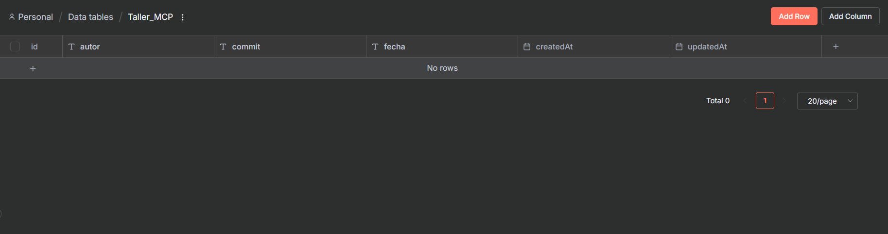
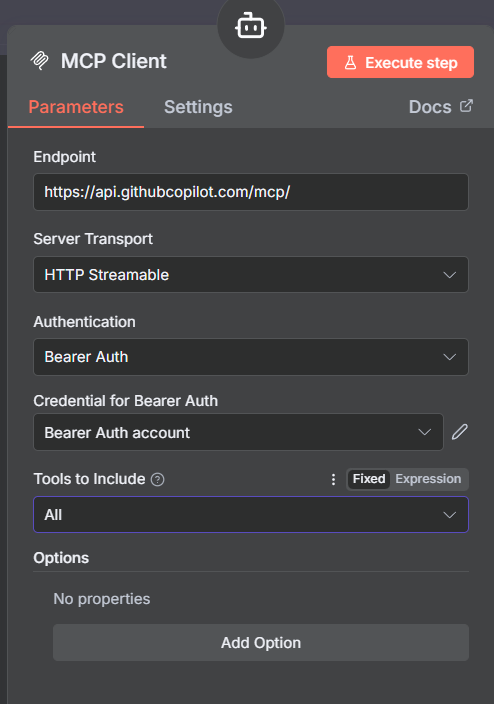
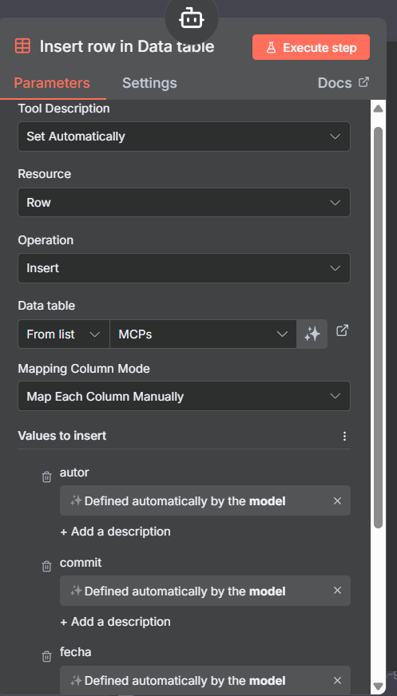
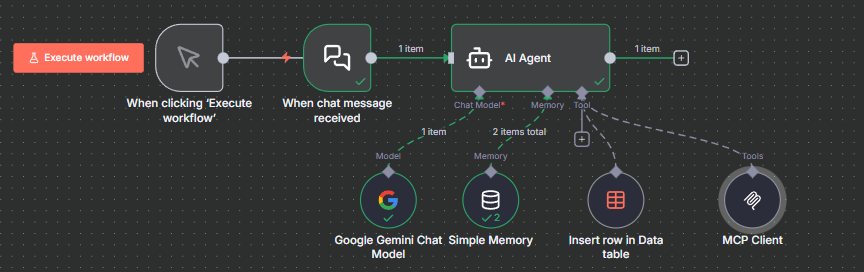
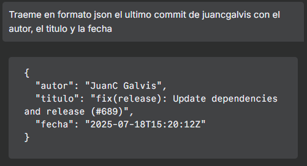
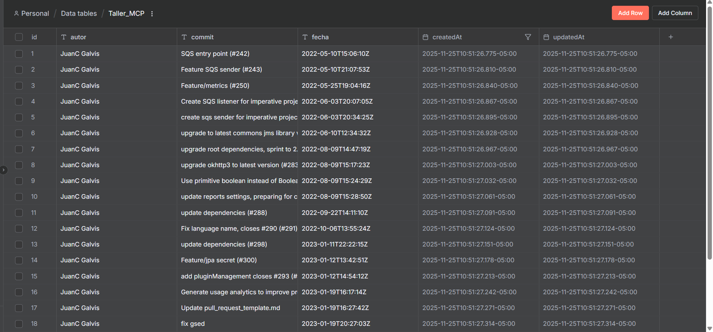
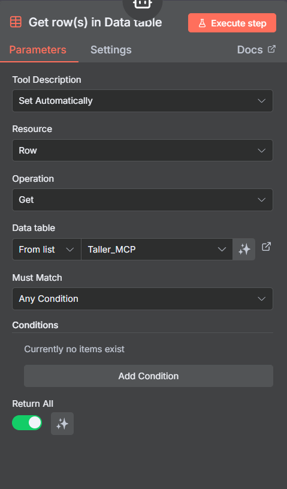

# Taller de n8n: Agente de Investigación Automatizado

Este instructivo guía la creación de un agente que interactúa con el MCP de GitHub y nos permitirá interactuar con repositorios, desde realizar forks hasta extraer información de cada uno de los commits.

## Objetivo
- Construir un agente principal con chat, memoria y un MCP de GitHub.
- Realizar el fork de un repositorio de código abierto del banco (https://github.com/bancolombia/scaffold-clean-architecture), extraer los commits del contribuidor juancgalvis y realizar análisis.

## Preparación

### Requisitos Previos (completar ANTES del taller)
Para aprovechar al máximo el tiempo, asegúrate de tener listo:

- ✅ Cuenta en n8n Cloud (prueba gratuita): https://app.n8n.cloud/register
- ✅ Cuenta en GitHub + Personal Access Token con todos los permisos: https://github.com/settings/tokens
  - **Importante**: Al crear el token, selecciona todos los scopes (permisos)
- ✅ API Key de Gemini (Google AI Studio / Google Cloud): 
  - [Google Cloud Console](https://console.cloud.google.com/marketplace/product/google/generativelanguage.googleapis.com) Ahi habilitan el uso de gemini
  y aqui: https://console.cloud.google.com/apis/credentials crean el api key.
  - Modelo recomendado: `models/gemini-2.5-flash`.

> **💡 Tip**: Si es tu primera vez con estas plataformas, completa este paso con 1-2 días de anticipación para resolver cualquier problema de acceso.

## Arquitectura
- Conversación en Chat → Agente Principal → MCP → DataTables.

## Parte 1: Crear Data Table
**⏱️ Tiempo estimado: 3-5 minutos**

1. Crear una Data Table con el nombre `Taller_MCP`.

2. Dentro de la tabla, crear 3 columnas:
   - Autor
   - Commit
   - Fecha

## Parte 2: Agente Principal (desde cero)
**⏱️ Tiempo estimado: 15-20 minutos**

1. **Crear workflow**
   - Nombre: `GitHub MCP taller n8n`.

2. **Nodo: Chat Trigger**
   - Añadir "Chat Trigger" (AI). Dejar opciones por defecto.
   - Conectar salida a "AI Agent".

3. **Nodo: AI Agent**
   - Añadir "AI Agent". Dejar opciones por defecto.

4. **Nodo: Google Gemini Chat Model**
   - Añadir "Google Gemini Chat Model".
   - Credenciales: selecciona tu cuenta de Gemini.
   - Modelo: `models/gemini-2.5-flash`.
   - Conectar a la entrada `ai_languageModel` del "AI Agent".

5. **Nodo: Simple Memory**
   - Añadir "Simple Memory".

6. **Nodo: Tool MCP Client**
   - Endpoint: https://api.githubcopilot.com/mcp/
   - Authentication: Bearer Auth
   - Credential: Añadir credencial generada en https://github.com/settings/tokens

   

7. **Nodo: Insert rows in Data Table**
   - Seleccionar la tabla creada anteriormente.
   - Seleccionar que los 3 valores sean definidos automáticamente por el modelo.
   
   

8. **Activar workflow**
   - Guarda y activa.
   - Abre el chat embebido en n8n para probar.
   
   

> **💡 Troubleshooting**: Si el agente no responde, verifica que:
> - Las credenciales de Gemini estén correctamente configuradas
> - El token de GitHub tenga los permisos necesarios
> - Todos los nodos estén conectados correctamente (revisa las líneas de conexión)

---

## Parte 3: Familiarizarse con el MCP
**⏱️ Tiempo estimado: 8-10 minutos**

1. **Pregunta inicial**: ¿Qué puedes hacer con el MCP de GitHub que tienes?

2. **Realizar consultas de práctica**: Realicen algunas consultas para familiarizarse, tales como "¿Cuántos repos tengo en GitHub?" (Si en algún momento el agente responde que no puede, recuérdenle que tiene el MCP de GitHub como herramienta y que lo use).

3. **Hacer fork del repositorio**: Realizaremos un fork del repositorio https://github.com/bancolombia/scaffold-clean-architecture. Díganle al agente que lo haga.

4. **Consultas adicionales**: Realicen algunas consultas tales como: ¿cuántos commits tiene ese repositorio? o ¿cuál es el usuario con más commits?

## Parte 4: Guardar datos en Data Tables
**⏱️ Tiempo estimado: 10-15 minutos**

> **⚠️ Nota**: La extracción de 100 commits puede tardar 2-3 minutos dependiendo de la velocidad de la API de GitHub.

1. **Solicitar último commit**: Pidan en formato JSON el último commit de juancgalvis con el autor, el título y la fecha del repositorio https://github.com/bancolombia/scaffold-clean-architecture

   

2. **Guardar en Data Table**: Píданle que lo guarde en la Data Table.

   

3. **Eliminar registro de prueba**: Bien, ahora que probamos que funciona, eliminemos ese registro.

4. **Guardar múltiples commits**: Ahora píданle que traiga los últimos 100 commits de ese usuario y que los guarde en la Data Table.

   

## Parte 5: Tomar los datos y cargarlos a GitHub
**⏱️ Tiempo estimado: 5-8 minutos**

1. **Agregar nodo Get Rows**: Vamos a agregar el nodo "Get rows in Data Table".

   

2. **Subir datos al repositorio**: Le pediremos al agente que tome los datos del Data Table y los suba al repositorio al que hicimos fork como un archivo, creando un commit.

---

## Retos Adicionales
**⏱️ Tiempo estimado por reto: 5-15 minutos cada uno**

> **💡 Sugerencia**: Comienza con los Retos 1-3 (más accesibles) antes de intentar los más avanzados.

### Reto 1: Análisis de Contribuidores ⭐
**Dificultad**: Fácil | **Tiempo**: ~5 minutos

Crea un análisis detallado de todos los contribuidores del repositorio. Solicita al agente que:
- Identifique los 5 contribuidores con más commits.
- Calcule el porcentaje de contribución de cada uno.
- Guarde esta información en una nueva Data Table llamada `Contribuidores_Stats`.

### Reto 2: Línea de Tiempo de Commits ⭐
**Dificultad**: Fácil | **Tiempo**: ~8 minutos

Implementa un análisis temporal de los commits:
- Solicita al agente que extraiga todos los commits del último año.
- Agrupa los commits por mes y cuenta cuántos commits hubo en cada período.
- Identifica el mes con mayor actividad de desarrollo.

### Reto 3: Análisis de Mensajes de Commit ⭐⭐
**Dificultad**: Media | **Tiempo**: ~10 minutos

Realiza un análisis de patrones en los mensajes de commit:
- Extrae los mensajes de los últimos 50 commits.
- Identifica las palabras más comunes en los mensajes (excluyendo palabras comunes como "the", "and", etc.).
- Clasifica los commits por tipo (fix, feature, refactor, docs, etc.) basándose en convenciones de commits.

### Reto 4: Crear Issues Automáticamente ⭐⭐
**Dificultad**: Media | **Tiempo**: ~7 minutos

Utiliza el MCP de GitHub para:
- Crear un nuevo issue en tu fork del repositorio.
- El issue debe contener un resumen del análisis de commits realizado.
- Incluye estadísticas relevantes como total de commits analizados, contribuidor principal, y período de tiempo.

### Reto 5: Comparación de Ramas ⭐
**Dificultad**: Fácil | **Tiempo**: ~5 minutos

Explora las capacidades del MCP para:
- Listar todas las ramas del repositorio.
- Comparar la rama principal con otra rama (si existe).
- Identificar cuántos commits de diferencia hay entre ellas.

### Reto 6: Gestión de Pull Requests ⭐⭐
**Dificultad**: Media | **Tiempo**: ~8 minutos

Experimenta con Pull Requests:
- Lista todos los Pull Requests abiertos del repositorio original.
- Extrae información de al menos 3 PRs: título, autor, número de comentarios y estado.
- Guarda esta información en una Data Table llamada `Pull_Requests`.

### Reto 7: Workflow Complejo con Condicionales ⭐⭐⭐
**Dificultad**: Avanzada | **Tiempo**: ~15 minutos

Crea un workflow más avanzado que:
- Permita al usuario especificar un rango de fechas.
- Extraiga solo los commits dentro de ese rango.
- Si el número de commits es mayor a 50, guarde solo los primeros 50.
- Si es menor, los guarde todos.
- Envíe una notificación (puede ser un mensaje en el chat) con un resumen de la operación.

### Reto 8: Exportar Datos a Formato CSV ⭐⭐
**Dificultad**: Media | **Tiempo**: ~10 minutos

Extiende la funcionalidad del agente para:
- Tomar los datos de la Data Table.
- Formatearlos como CSV.
- Crear un nuevo archivo CSV en el repositorio con estos datos.
- Hacer commit del archivo con un mensaje descriptivo.

### Reto 9: Búsqueda de Código ⭐
**Dificultad**: Fácil | **Tiempo**: ~6 minutos

Utiliza las capacidades de búsqueda del MCP:
- Busca archivos que contengan una palabra clave específica (por ejemplo, "gradle").
- Lista los archivos encontrados con su ruta completa.
- Cuenta cuántas ocurrencias de esa palabra hay en todo el repositorio.

### Reto 10: Dashboard de Métricas ⭐⭐⭐
**Dificultad**: Avanzada | **Tiempo**: ~15 minutos

Crea un reporte completo que incluya:
- Total de commits en el repositorio.
- Número de contribuidores únicos.
- Commits promedio por contribuidor.
- Fecha del primer y último commit.
- Lenguaje de programación principal del repositorio.
- Guarda este dashboard como un archivo markdown en tu fork.

---

## Consejos y Mejores Prácticas

- **Manejo de Errores**: Si el agente no responde como esperas, sé más específico en tus instrucciones.
- **Límites de API**: Ten en cuenta que GitHub tiene límites de tasa para su API. Si haces muchas solicitudes, podrías necesitar esperar.
- **Formato de Datos**: Especifica siempre el formato en el que quieres recibir la información (JSON, texto plano, tabla, etc.).
- **Tokens de Acceso**: Asegúrate de que tu Personal Access Token tenga los permisos necesarios para las operaciones que deseas realizar.
- **Memoria del Agente**: Aprovecha la memoria simple para que el agente recuerde contexto de conversaciones anteriores.

---

¡Felicitaciones! Has completado el taller de n8n con MCPs. Ahora tienes las herramientas para crear agentes automatizados que interactúan con GitHub y pueden realizar análisis complejos de repositorios.
